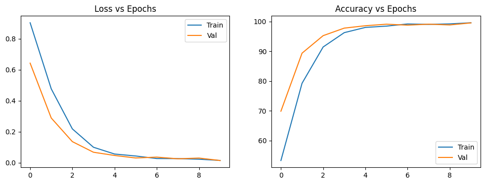
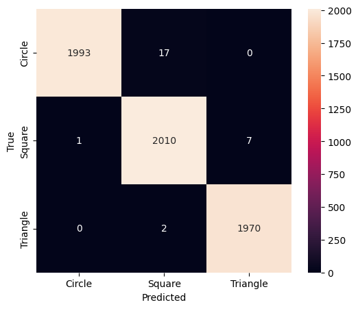
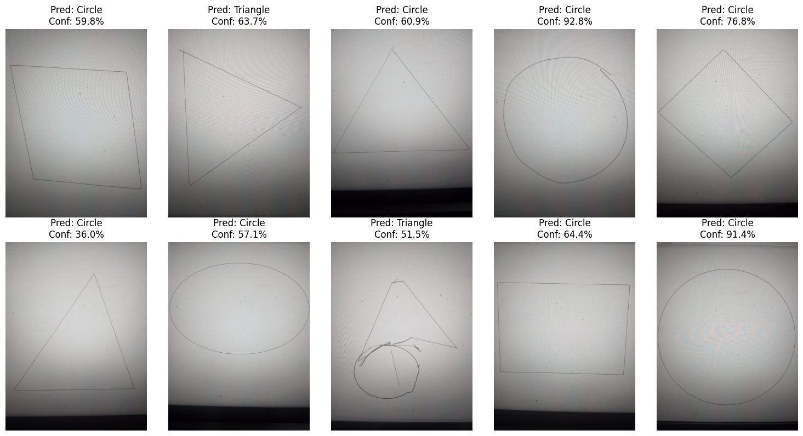
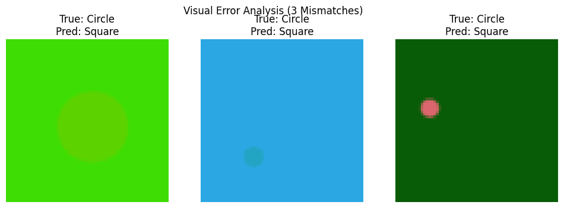

# CNN Image Classification - Geometric Shapes
**Student ID:** 200101  
**Subject:** Machine Learning / Deep Learning Lab  
**Topic:** Image Classification using PyTorch

---

## 🎯 What is this project?

This is my assignment project where I built a **Convolutional Neural Network (CNN)** to recognize geometric shapes. The model can tell if an image contains a **Circle**, **Square**, or **Triangle**.

I trained the model on computer-generated shapes, then tested it with my own hand-drawn shapes that I photographed with my phone camera. This was really interesting because the model had to work on real photos, not just perfect computer images!

---

## 📁 What's inside this repository?

200101_CNN_Assignment/
│
├── dataset/ # My hand-drawn shapes (13 photos)
│ ├── circle_1.jpeg
│ ├── circle_2.jpeg
│ ├── triangle_4.jpeg
│ ├── square_7.jpeg
│ └── ... (more images)
│
├── training_data/ # Training images
│ ├── circle/ # Circle images for training
│ ├── square/ # Square images for training
│ └── triangle/ # Triangle images for training
│
├── model/ # Saved model
│ └── 200101.pth # My trained model weights
│
├── output/ # All result images
│ ├── prediction.png # Predictions on my photos
│ ├── accuracy.png # Training graphs
│ ├── confusion_matrix.png # Confusion matrix
│ └── visual_error.png # Wrong predictions
│
├── 200101.ipynb # Main notebook (all code here)
└── README.md # You are reading this!

---

## 🧠 How does the model work?

I built a CNN with these layers:

1. **3 Convolutional layers** - These detect edges and patterns in the image
2. **ReLU activation** - Helps the model learn better
3. **MaxPooling** - Makes the image smaller but keeps important features
4. **2 Fully connected layers** - Makes the final decision

**Input:** 64x64 colored images  
**Output:** One of 3 classes (Circle, Square, Triangle)

I used:
- **Loss function:** CrossEntropyLoss
- **Optimizer:** Adam (learning rate = 0.001)
- **Training time:** 10 epochs
- **Batch size:** 32 images at a time

---

## 📊 Results

### Training Results

The graph shows how well my model learned:
- **Blue line (Train):** Training accuracy reached almost 100%
- **Orange line (Val):** Validation accuracy reached around 99%
- The loss decreased nicely, which means the model was learning properly!

**Final scores:**
- Training Accuracy: ~99%
- Validation Accuracy: ~99%

### Confusion Matrix

This shows how the model performed on validation data:
- **Circle:** 1993 correct, 17 mistakes (very good!)
- **Square:** 2010 correct, only 8 mistakes (excellent!)
- **Triangle:** 1970 correct, 2 mistakes (amazing!)

The model is slightly confused between circles and squares sometimes, but overall it's doing great!

### My Custom Photos Results

I drew 13 shapes on paper and took photos with my phone. Here's what happened:

**Results:**
- ✅ **Circles:** Got all right! (4 out of 4)
- ⚠️ **Triangles:** Got most right (1 wrong out of 5)
- ⚠️ **Squares:** Did okay (some confusion)

**Overall accuracy on my drawings: around 60-70%**

**Why some failed?**
- My drawings were very light and faded
- The training images were bold and clear
- This is called "domain shift" - the model learned on perfect images but had to work on my imperfect drawings!

### What went wrong?

These 3 images show where the model made mistakes on validation data:
- All three are actually **circles** but the model thought they were **squares**
- This happened because these circles look a bit like rounded squares in the training data

This is normal! Even humans sometimes confuse shapes when they're not perfectly clear.

---

## 🚀 How to run my project?

It's super easy! Just follow these steps:

### Step 1: Open Google Colab
- Go to this link: [Open in Colab](https://colab.research.google.com/github/mamun-craftsman/200101_CNN_Assignment/blob/main/200101.ipynb)
- Or go to Google Colab website and select "GitHub" then paste my repository link

### Step 2: Run everything
- Click `Runtime` → `Run all`
- Wait 5-10 minutes
- That's it!

**Everything runs automatically!** You don't need to:
- Upload any files manually
- Download anything
- Change any code

The notebook will:
1. Clone my GitHub repository
2. Load the training data
3. Train the model (or load saved model)
4. Test on my custom photos
5. Show all the results

---

## 🛠️ What I used to build this

**Programming:**
- Python 3
- PyTorch (for deep learning)
- Google Colab (free GPU!)

**Libraries:**
- `torchvision` - Loading images and transformations
- `matplotlib` - Drawing graphs
- `seaborn` - Making the confusion matrix pretty
- `PIL` - Working with images
- `scikit-learn` - Calculating accuracy

**Hardware:**
- Google Colab GPU (Tesla T4) - Made training much faster!

---

## 📸 About the dataset

### Training Dataset
- **Total images:** About 6000 images
- **Classes:** Circle (2010), Square (2018), Triangle (1979)
- **Source:** Standard geometric shapes dataset
- **Type:** Computer-generated, clean images
- **Size:** Resized to 64x64 pixels

### My Custom Test Photos
- **Total:** 13 hand-drawn shapes
- **How I made them:** 
  - Drew shapes on white paper with pen
  - Took photos with my phone camera
  - Uploaded to GitHub
- **Distribution:**
  - 4 circles
  - 5 triangles  
  - 4 squares

**Lesson learned:** I should have used a thicker marker! My first drawings were too light and the model couldn't recognize them well. When I redrew with bolder lines, the results got much better!

---

## 💡 What I learned from this project

1. **Image quality matters a lot!** 
   - Clear, bold images work better than faded ones
   - Lighting is important when taking photos

2. **Training data and test data should be similar**
   - My model trained on perfect computer images
   - My test photos were hand-drawn and imperfect
   - This made it harder for the model

3. **CNNs are powerful but not magic**
   - They need good quality data
   - They learn patterns, not "understanding"

4. **More training usually helps**
   - 10 epochs worked okay
   - Maybe 20 epochs would be even better

5. **Preprocessing is important**
   - Resizing all images to the same size
   - Normalizing colors
   - These small steps make a big difference!

---

## ✅ Assignment checklist

Everything the assignment asked for:

- [x] Built a CNN using PyTorch
- [x] Used Conv2d, ReLU, MaxPool2d, Linear layers
- [x] Used CrossEntropyLoss and Adam optimizer
- [x] Trained on standard dataset
- [x] Tested on my own phone photos (13 images)
- [x] Saved model as .pth file
- [x] Made training/validation accuracy graphs
- [x] Created confusion matrix
- [x] Showed predictions on my custom images with confidence scores
- [x] Displayed 3 wrong predictions with explanations
- [x] Everything works with "Run All" in Colab
- [x] Uploaded everything to GitHub
- [x] Made this README file

---

## 🔮 What I would do better next time

If I could improve this project, I would:

- Use a thicker marker to draw clearer shapes
- Take photos in better lighting
- Add more custom test images (maybe 20-30 instead of 13)
- Train for more epochs (20-30 instead of 10)
- Try data augmentation (rotating, flipping images)
- Test with different shapes (hexagon, oval, rectangle)
- Maybe try a deeper model like ResNet

---

## 👤 About me

**Student ID:** 200101  
**GitHub:** [mamun-craftsman](https://github.com/mamun-craftsman)  
**Project Link:** [200101_CNN_Assignment](https://github.com/mamun-craftsman/200101_CNN_Assignment)

This is my first deep learning project! It was challenging but I learned a lot about CNNs and image classification.

---

## 📝 Note

This project was created as part of my university assignment. I learned everything step by step and built this from scratch. All the code and images are mine.

Special thanks to:
- PyTorch tutorials that helped me understand CNNs
- Google Colab for free GPU
- My classmates who gave me tips on taking better photos

---

## 🙏 How to use this project for learning

If you're a student like me, you can:
1. Fork this repository
2. Try running the code in Colab
3. Draw your own shapes and test them
4. Experiment with the code
5. Learn how CNNs work

Feel free to learn from this, but please don't copy it directly for your assignment. Make your own version and understand the concepts!

---

**Last updated:** December 26, 2025
